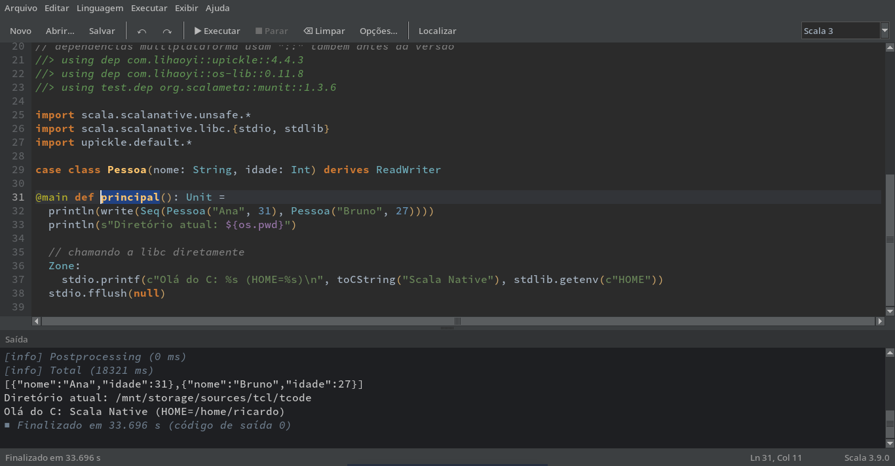

# tcode

Editor/console para avaliação rápida de código em várias linguagens, escrito em
Tcl/Tk. Não é uma IDE: é **um arquivo só** (`tcode.tcl`), sem dependências além
de Tcl/Tk 8.6 ou 9.x.

Inspirado no *groovyConsole*: editor em cima, saída da execução embaixo. O
código roda em um processo separado, então a interface não trava e a execução
pode ser interrompida a qualquer momento.



> Internamente o programa se identifica como **qconsole** (versão 2.0): esse é
> o nome usado no arquivo de configuração e no diretório de linguagens do
> usuário.

## Recursos

- Destaque de sintaxe, números de linha, realce da linha atual e de pares de
  parênteses/chaves/colchetes
- Indentação automática por linguagem, Tab/Shift+Tab em blocos, comentar e
  descomentar linhas, duplicar linha
- Localizar/substituir (com regex e diferenciação de maiúsculas), ir para linha
- Executar o arquivo inteiro ou só a seleção, com opções do interpretador e
  argumentos do programa configuráveis por linguagem
- Mensagens de erro clicáveis na saída: levam direto à linha (e coluna) do
  erro no editor
- Saída com cores ANSI, stderr, avisos e mensagens informativas destacados
- Detecção automática do interpretador e da versão instalada
- Modelos de código (Arquivo > Novo a partir de modelo)
- Arquivos recentes, tamanho de fonte, quebra de linha, geometria da janela e
  linguagem são lembrados entre sessões
- Tema escuro inspirado no Darcula
- Novas linguagens podem ser adicionadas por arquivos externos, sem mexer no
  script

## Linguagens embutidas

| Linguagem | Extensões | Interpretadores |
|-----------|-----------|-----------------|
| Tcl/Tk    | `.tcl .tk .tm .test` | `tclsh` (de preferência o da mesma instalação do `wish`) |
| Scala 3   | `.sc .scala` | `scala`, `scala-cli` |
| Scheme    | `.scm .ss .sls .sps .sld` | Guile, Chez Scheme |
| OCaml     | `.ml .mli .mlx` | `ocaml`, OxCaml (switch do opam) |
| Shell     | `.sh .bash .zsh .ksh` | `bash`, `sh`, `zsh`, `dash` |

Detalhes por linguagem:

- **Tcl** — o script roda num wrapper que mostra o valor de retorno do script
  ("Resultado: …") e o `errorInfo` em caso de erro. Se o script criar janelas
  Tk, elas permanecem abertas até serem fechadas.
- **Scala 3** — detecta se o código é um script (`.sc`, instruções soltas) ou
  um fonte com `@main`/`def main`/`extends App` (`.scala`). Há modelos para
  JVM, Scala.js e Scala Native usando diretivas `//> using` do scala-cli.
- **Scheme** — indentação no estilo Lisp. No Guile o código é compilado antes
  de rodar, para que os erros tragam linha e coluna.
- **OCaml** — o runner OxCaml procura o toplevel no switch ativo do opam
  (`OPAM_SWITCH_PREFIX`) ou em `~/.opam/*ox*/bin/ocaml`.

## Uso

```sh
wish tcode.tcl ?-lang tcl|scala|scheme|ocaml|shell? ?arquivo?
```

Ou, com permissão de execução:

```sh
./tcode.tcl exemplo.scm
```

Sem `-lang`, a linguagem é escolhida pela extensão do arquivo; sem arquivo, é
usada a última linguagem da sessão anterior.

Se o interpretador não for encontrado no `PATH`, indique o executável em
**Executar > Opções de execução** (Ctrl+E). Na mesma janela é possível escolher
o interpretador, as opções passadas a ele e os argumentos do programa.

## Atalhos de teclado

| Atalho | Ação |
|--------|------|
| Ctrl+R / Ctrl+Enter | Executar |
| Ctrl+Shift+R | Executar seleção |
| Ctrl+Break | Interromper execução |
| Ctrl+W | Limpar saída |
| Ctrl+E | Opções de execução |
| Ctrl+N / Ctrl+O / Ctrl+S | Novo / Abrir / Salvar |
| Ctrl+Shift+S | Salvar como |
| Ctrl+F4 | Fechar arquivo |
| Ctrl+Q | Sair |
| Ctrl+Z / Ctrl+Y | Desfazer / Refazer |
| Ctrl+F / Ctrl+H | Localizar / Substituir |
| F3 / Shift+F3 | Próximo / Anterior |
| Ctrl+L | Ir para linha |
| Ctrl+D | Duplicar linha |
| Ctrl+/ | Comentar/descomentar linhas |
| Tab / Shift+Tab | Indentar / Desindentar |
| Ctrl++ / Ctrl+- / Ctrl+0 | Aumentar / diminuir / restaurar fonte |

## Configuração

As preferências ficam em `~/.qconsolerc` (um dicionário Tcl, gravado ao sair).
Opções de execução são guardadas por linguagem.

## Adicionando linguagens

Arquivos `*.tcl` nestes diretórios são carregados na inicialização:

- `<diretório do tcode.tcl>/lang/`
- `~/.config/qconsole/lang/`

Um arquivo pode definir uma linguagem nova ou redefinir uma embutida. Exemplo
para Lua:

```tcl
qc::language lua {
    name     Lua
    ext      {.lua}
    comment  --                  ;# prefixo de comentário (Ctrl+/)
    indent   2
    tokens {                     ;# ordem = prioridade em empates
        comment {--[^\n]*}       ;# regex ARE, sem grupos de captura...
        string  {"(?:[^"\\\n]|\\.)*"?}
        number  {\m[0-9]+(?:\.[0-9]+)?\M}
        word    {[A-Za-z_][A-Za-z0-9_]*}   ;# "word": classificado por "words"
        brace   {[][(){}]}
    }                            ;# ...ou com UM grupo: só ele é colorido
    words    { keyword {local function end if then else return} }
    defWords {function}          ;# a palavra seguinte recebe a tag defname
    indentAfter {(?:\mthen|\mdo|\mfunction\M.*\)|\{)\s*$}
    runners {
        {name lua exe {lua5.4 lua} args {%O %F %A} version {-v}
         versionRe {Lua ([0-9.]+)}}
    }
    errPatterns {{%F:([0-9]+):}} ;# grupo 1 = linha, grupo 2 = coluna
}
```

Nos `args` do runner:

| Marcador | Significado |
|----------|-------------|
| `%F` | arquivo a executar |
| `%W` | wrapper (chave `wrapper` do runner) |
| `%O` | opções do interpretador definidas pelo usuário |
| `%A` | argumentos do programa |
| `%--A` | `-- args`, se houver argumentos |

Outras chaves aceitas: `capType`, `numberWord`, `sub`, `styles`, `commentRe`,
`commentEnd`, `dedentChars`, `defThroughBrace`, `col0`, `infoRe`, `warnRe`,
`grayInfo` (veja `langDefaults` no código).

Hooks opcionais podem ser definidos como procs em `::qc::lang::<id>::` —
`init`, `wordTag`, `prepare`, `defaultExt`, `newlineIndent`, `stderrLine`,
`findExe` (as linguagens embutidas servem de exemplo).

Modelos de código são registrados com `qc::template`:

```tcl
qc::template lua "Olá" {print("olá, mundo")}
```

Tags de cor disponíveis: `keyword`, `defname`, `type`, `string`, `comment`,
`number`, `var`, `interp`, `option`, `annot`, `brace`, `directive`, `builtin`,
`constant`, `symbol`. A chave `styles` permite definir novas.

Erros ao carregar arquivos de linguagem aparecem na saída ao iniciar e em
**Ajuda > Sobre**.

## Requisitos

- Tcl/Tk 8.6 ou 9.x
- Os interpretadores das linguagens que você quiser executar
